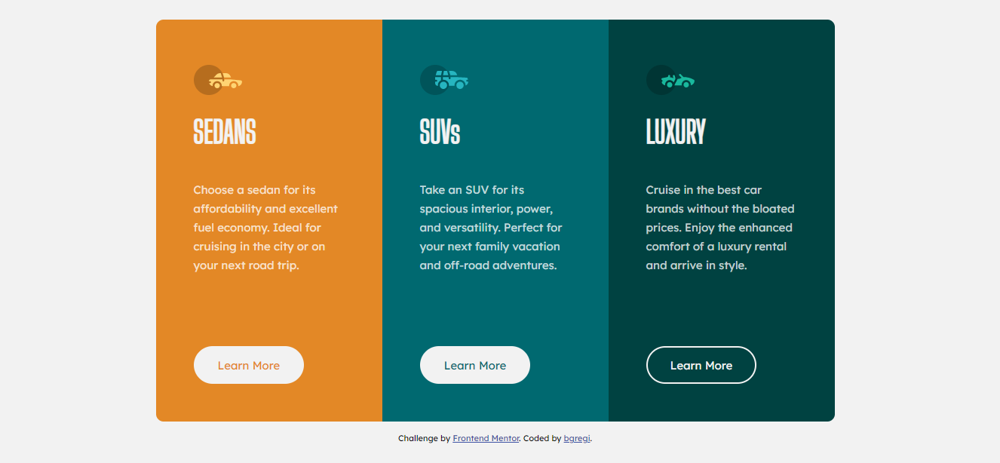

# Frontend Mentor - 3-column preview card component solution

This is a solution to the [3-column preview card component challenge on Frontend Mentor](https://www.frontendmentor.io/challenges/3column-preview-card-component-pH92eAR2-). Frontend Mentor challenges help you improve your coding skills by building realistic projects. 

## Table of contents

- [Overview](#overview)
  - [The challenge](#the-challenge)
  - [Screenshot](#screenshot)
  - [Links](#links)
- [My process](#my-process)
  - [Built with](#built-with)
  - [What I learned](#what-i-learned)
  - [Continued development](#continued-development)
- [Author](#author)

## Overview

### The challenge

Users should be able to:

- View the optimal layout depending on their device's screen size
- See hover states for interactive elements

### Screenshot

### Links

- Solution URL: [https://github.com/bgregi/fm-column-preview-card](https://github.com/bgregi/fm-column-preview-card)
- Live Site URL: [https://bgregi.github.io/fm-column-preview-card/](https://bgregi.github.io/fm-column-preview-card/)

## My process

### Built with

- Semantic HTML5 markup
- CSS custom properties
- Flexbox
- Mobile-first workflow

### What I learned

In this challenge I had to research about the active status of components to be able to style them differently when the user clicks on them. This lead me to find out how the border properties act on the text inside the button and how to fix some problems that happen when you change the border and background colors.

This was also my first design using the "mobile first" approach.

### Continued development

The main problem I faced while doing this challenge was compatibility with different screen sizes. I was able to make it work for any screen size, except the tablet size (768 pixels), which made the boxes render in different heights. That's a problem I intend to learn about in the next challenges.

## Author

- Website - [bgregi's GitHub Profile](https://github.com/bgregi)
- Frontend Mentor - [@bgregi](https://www.frontendmentor.io/profile/bgregi)
